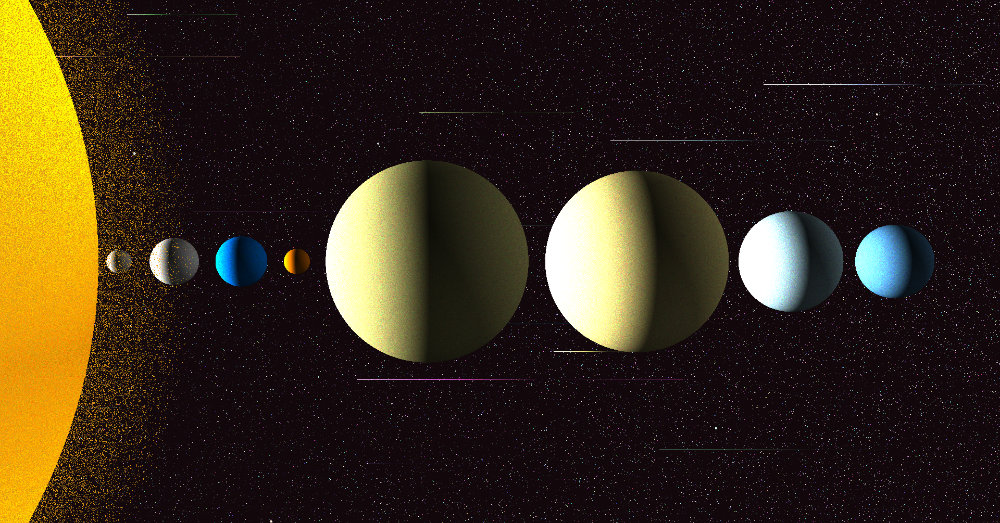

# Solar System

A simple raytracing render engine written in python that renders the image of our solar system.



## Installation

```bash
git clone https://github.com/alok1974/solar_system.git
cd solar_system
python3 -m venv .venv
source ./.venv/bin/activate
python3 -m pip install --upgrade pip
python3 -m pip install -r requirements.txt
```

## Rendering

```bash
python3 ./src/solar_system.py
```

The image will be created as `render.png` in the `/image` folder. The image will be overwritten if it already exists.
